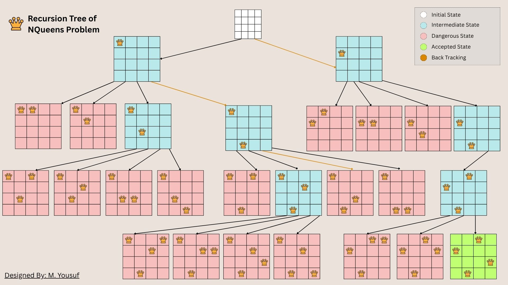

# 🌟 N-Queens Problem Solver 🌟

> Find all possible arrangements of N queens on an N×N chessboard where no two queens can attack each other.

## 📋 Table of Contents

- [Problem Description](#-problem-description)
- [How to Run](#-how-to-run)
- [Algorithm Explanation](#-algorithm-explanation)
- [Board Representation](#-board-representation)
- [The `is_safe()` Function](#-the-is_safe-function)
- [Diagonal Attack Patterns](#-diagonal-attack-patterns)
- [Backtracking Visualization](#-backtracking-visualization)
- [Example Walkthrough](#-example-walkthrough)
- [Time Complexity](#-time-complexity)

---

## 📝 Problem Description

The **N-Queens problem** is a classic constraint satisfaction problem where you must place N chess queens on an N×N chessboard such that:

- ✅ No two queens share the same **row**
- ✅ No two queens share the same **column**
- ✅ No two queens share the same **diagonal**

### Special Cases:
- **n = 1**: Trivial case with 1 solution
- **n = 2, 3**: No solutions exist
- **n = 4**: 2 solutions
- **n = 8**: 92 solutions

---

## 🚀 How to Run

### Prerequisites
Make sure you have Python 3.x installed and the `colors.py` file in the same directory.

### Running the Program

```bash
# Column-wise approach
python nqueen-col.py

# Row-wise approach
python nqueen-row.py
```

### Interactive Input

```
Enter the number of queens (n): 4

Total Queens: 4
Solving... Please wait...
```

---

## 🧠 Algorithm Explanation

This implementation uses **backtracking** to explore all possible queen placements:

1. **Start** from the first column (or row)
2. **Try** placing a queen in each position of the current column
3. **Check** if the placement is safe using `is_safe()`
4. **Recurse** to the next column (or row) if placement is valid
5. **Backtrack** if no valid placement is found

### Pseudocode

```
function placeQueens(col):
    
    # Base case: All queens placed
    if col == n:
        # Found a solution!
        add current board to solutions
        return
    
    for each row in 0 to n-1:
        if is_safe(col, row):
            place queen at current position (col, row)
            placeQueens(col + 1)     # Recurse for next column
            
            # Backtrack
            remove queen from current position (col, row) 
```

---

## 📊 Board Representation

We use a **1D array** instead of a 2D array for memory efficiency:

```python
board = [-1] * n  # board[i] represents row/col position of queen in column/row i
```

### Example for 4-Queens:

```python
board = [1, 3, 0, 2]
```

**Meaning:**
- Column 0: Queen at row 1
- Column 1: Queen at row 3
- Column 2: Queen at row 0
- Column 3: Queen at row 2

**Visual Representation:**

```
    0   1   2   3   (columns)
  +---+---+---+---+
0 | . | . | Q | . |  ← board[2] = 0
  +---+---+---+---+
1 | . | Q | . | . |  ← board[0] = 1
  +---+---+---+---+
2 | . | . | . | Q |  ← board[3] = 2
  +---+---+---+---+
3 | . | . | . | . |  ← board[1] = 3
  +---+---+---+---+
```

### Why `-1`?
The value `-1` indicates "**no queen placed yet**" since valid row/column indices are 0 to n-1.

---

## 🛡️ The `is_safe()` Function

The `is_safe(col, row)` function checks if placing a queen at position `(col, row)` is valid.

### Function Signature

```python
def is_safe(col, row):
    """
    Check if placing a queen at (col, row) is safe
    
    Args:
        col: Current column where we want to place the queen
        row: Current row where we want to place the queen
    
    Returns:
        True if safe, False if conflicts with previously placed queens
    """
```

### The Three Safety Checks

```python
for i in range(col):  # Check all previously placed queens (columns 0 to col-1)
    
    # 1️⃣ Row Check: Same row attack
    if board[i] == row:
        return False
    
    # 2️⃣ Diagonal Check (↘): Top-left to bottom-right
    if board[i] - i == row - col:
        return False
    
    # 3️⃣ Diagonal Check (↙): Top-right to bottom-left
    if board[i] + i == row + col:
        return False

return True  # Safe to place queen
```

### Compact Version

```python
def is_safe(col, row):
    for i in range(col):
        if board[i] == row or \
           board[i] - i == row - col or \
           board[i] + i == row + col:
            return False
    return True
```

**Variable Meanings:**
- `i`: Column iterator (0 to col-1)
- `board[i]`: Row position of queen already placed in column `i`
- `row`: Row where we want to place new queen
- `col`: Column where we want to place new queen

---

## 🔍 Diagonal Attack Patterns

### Why These Formulas Work? 🤔

The diagonal attack checks use mathematical properties of chess diagonals.

---

### Diagonal 1: `row - col` (↘ Direction)

All cells on the same **top-left to bottom-right** diagonal have the **same difference** between their row and column indices.

#### Example on 5×5 Board:

```
    0   1   2   3   4   (columns)
  +---+---+---+---+---+
0 | 0 | 1 | 2 | 3 | 4 |  ← row - col values
  +---+---+---+---+---+
1 |-1 | 0 | 1 | 2 | 3 |
  +---+---+---+---+---+
2 |-2 |-1 | 0 | 1 | 2 |
  +---+---+---+---+---+
3 |-3 |-2 |-1 | 0 | 1 |
  +---+---+---+---+---+
4 |-4 |-3 |-2 |-1 | 0 |
  +---+---+---+---+---+
```

**Diagonal Examples:**
- **Value 0**: (0,0), (1,1), (2,2), (3,3), (4,4) — Main diagonal
- **Value 2**: (0,2), (1,3), (2,4)
- **Value -2**: (2,0), (3,1), (4,2)

**Formula:** `row - col`

If two positions have the same `row - col` value, they're on the same ↘ diagonal

---

### Diagonal 2: `row + col` (↙ Direction)

All cells on the same **top-right to bottom-left** diagonal have the **same sum** of their row and column indices.

#### Example on 5×5 Board:

```
    0   1   2   3   4   (columns)
  +---+---+---+---+---+
0 | 0 | 1 | 2 | 3 | 4 |  ← row + col values
  +---+---+---+---+---+
1 | 1 | 2 | 3 | 4 | 5 |
  +---+---+---+---+---+
2 | 2 | 3 | 4 | 5 | 6 |
  +---+---+---+---+---+
3 | 3 | 4 | 5 | 6 | 7 |
  +---+---+---+---+---+
4 | 4 | 5 | 6 | 7 | 8 |
  +---+---+---+---+---+
```

**Diagonal Examples:**
- **Value 4**: (0,4), (1,3), (2,2), (3,1), (4,0) — Anti-diagonal
- **Value 2**: (0,2), (1,1), (2,0)
- **Value 6**: (2,4), (3,3), (4,2)

**Formula:** `row + col`

If two positions have the same `row + col` value, they're on the same ↙ diagonal!

---

### 🎯 Visual Diagonal Attack Example

```
Queen at (1, 3) attacks these positions:

    0   1   2   3   4
  +---+---+---+---+---+
0 | . | . | . | X | . |  ← Same column
  +---+---+---+---+---+
1 | . | . | X | Q | X |  ← Queen here
  +---+---+---+---+---+
2 | . | X | . | X | . |  ← Diagonal attacks
  +---+---+---+---+---+
3 | X | . | . | X | . |
  +---+---+---+---+---+
4 | . | . | . | X | . |
  +---+---+---+---+---+

Diagonal 1 (↘): row - col = 1 - 3 = -2
  Positions: (0,2), (1,3), (2,4) → Same diagonal

Diagonal 2 (↙): row + col = 1 + 3 = 4
  Positions: (0,4), (1,3), (2,2), (3,1), (4,0) → Same diagonal
```

---

## 🔄 Backtracking Visualization

The algorithm explores the solution space using a **recursive tree**:



### Legend:
- ⚪ **White**: Initial state
- 🔵 **Blue**: Intermediate states (exploring)
- 🔴 **Red**: Invalid states (conflicts detected)
- 🟢 **Green**: Valid solutions found
- 🟤 **Brown**: Backtracking

---

## 📖 Example Walkthrough

Let's trace placing queens for a **4×4 board**:

### Initial State

```python
n = 4
board = [-1, -1, -1, -1]  # No queens placed yet
```

### Step-by-Step Execution

#### **Step 1:** Place queen in Column 0

```python
Try col=0, row=0
is_safe(0, 0) → True ✓
board = [0, -1, -1, -1]
```

```
    0   1   2   3
  +---+---+---+---+
0 | Q | . | . | . |  ← Queen placed
  +---+---+---+---+
1 | . | . | . | . |
  +---+---+---+---+
2 | . | . | . | . |
  +---+---+---+---+
3 | . | . | . | . |
  +---+---+---+---+
```

---

#### **Step 2:** Try Column 1

```python
Try col=1, row=0
is_safe(1, 0) → False ❌ (same row as queen in col 0)

Try col=1, row=1
is_safe(1, 1) → False ❌ (diagonal conflict: 0-0 == 1-1)

Try col=1, row=2
is_safe(1, 2) → True ✓
board = [0, 2, -1, -1]
```

```
    0   1   2   3
  +---+---+---+---+
0 | Q | . | . | . |
  +---+---+---+---+
1 | . | . | . | . |
  +---+---+---+---+
2 | . | Q | . | . |  ← Queen placed
  +---+---+---+---+
3 | . | . | . | . |
  +---+---+---+---+
```

---

#### **Step 3:** Try Column 2

```python
Try col=2, row=0
is_safe(2, 0) → False ❌ (same row)

Try col=2, row=1
is_safe(2, 1) → False ❌ (diagonal: 2-2 == 0-0)

Try col=2, row=2
is_safe(2, 2) → False ❌ (same row)

Try col=2, row=3
is_safe(2, 3) → False ❌ (diagonal: 2+2 == 0+0? No, but 2-2 == 3-? fails)

❌ No safe position in column 2!
BACKTRACK to column 1
```

---

#### **Step 4:** Backtrack and try next row in Column 1

```python
board = [0, -1, -1, -1]  # Remove queen from col 1

Try col=1, row=3
is_safe(1, 3) → True ✓
board = [0, 3, -1, -1]
```

```
    0   1   2   3
  +---+---+---+---+
0 | Q | . | . | . |
  +---+---+---+---+
1 | . | . | . | . |
  +---+---+---+---+
2 | . | . | . | . |
  +---+---+---+---+
3 | . | Q | . | . |  ← Queen placed
  +---+---+---+---+
```

---

#### **Step 5:** Continue...

Eventually after more backtracking, the algorithm finds:

**Solution 1:**
```python
board = [1, 3, 0, 2]
```

```
    0   1   2   3
  +---+---+---+---+
0 | . | . | Q | . |  ← board[2] = 0
  +---+---+---+---+
1 | . | Q | . | . |  ← board[0] = 1
  +---+---+---+---+
2 | . | . | . | Q |  ← board[3] = 2
  +---+---+---+---+
3 | . | . | . | . |  ← board[1] = 3
  +---+---+---+---+
```

**Solution 2:**
```python
board = [2, 0, 3, 1]
```

```
    0   1   2   3
  +---+---+---+---+
0 | . | Q | . | . |  ← board[1] = 0
  +---+---+---+---+
1 | . | . | . | Q |  ← board[3] = 1
  +---+---+---+---+
2 | Q | . | . | . |  ← board[0] = 2
  +---+---+---+---+
3 | . | . | Q | . |  ← board[2] = 3
  +---+---+---+---+
```

---

## 🔬 Detailed `is_safe()` Check Example

Let's verify if we can place a queen at `(col=2, row=2)` with existing queens:

```python
board = [1, 3, ?, ?]  # Queens at (0,1) and (1,3)
```

```
    0   1   2   3
  +---+---+---+---+
0 | . | Q | . | . |  ← (0,1)
  +---+---+---+---+
1 | . | . | . | Q |  ← (1,3)
  +---+---+---+---+
2 | . | . | ? | . |  ← Want to place here
  +---+---+---+---+
3 | . | . | . | . |
  +---+---+---+---+
```

### Check Against Queen at Column 0:

```python
i = 0, board[0] = 1

# Row check
board[0] == 2  →  1 == 2  →  False ✓

# Diagonal 1 (↘)
board[0] - 0 == 2 - 2
1 - 0 == 0
1 == 0  →  False ✓

# Diagonal 2 (↙)
board[0] + 0 == 2 + 2
1 + 0 == 4
1 == 4  →  False ✓
```

### Check Against Queen at Column 1:

```python
i = 1, board[1] = 3

# Row check
board[1] == 2  →  3 == 2  →  False ✓

# Diagonal 1 (↘)
board[1] - 1 == 2 - 2
3 - 1 == 0
2 == 0  →  False ✓

# Diagonal 2 (↙)
board[1] + 1 == 2 + 2
3 + 1 == 4
4 == 4  →  True ❌ CONFLICT!
```

**Visual Conflict:**

```
    0   1   2   3
  +---+---+---+---+
0 | . | Q | . | . |
  +---+---+---+---+
1 | . | . | . | Q |  ← This queen
  +---+---+---+---+
2 | . | . | X | . |  ← Attacks here!
  +---+---+---+---+
3 | . | . | . | . |
  +---+---+---+---+

Diagonal path: (1,3) → (2,2) → (3,1) → (4,0)
Both have row + col = 4
```

**Result:** `is_safe(2, 2)` returns `False` ❌

---

## ⏱️ Time and Space Complexity Analysis

- **Time Complexity**: O(N!)
  - In the worst case, we explore all N! permutations
  - However, pruning via `is_safe()` significantly reduces the search space

- **Space Complexity**: O(N)
  - Recursive call stack depth: N
  - Board array: N
  - No additional 2D arrays needed

### Number of Solutions by N:

| N   | Solutions |
|-----|-----------|
| 1   | 1         |
| 2   | 0         |
| 3   | 0         |
| 4   | 2         |
| 5   | 10        |
| 6   | 4         |
| 7   | 40        |
| 8   | 92        |
| 9   | 352       |
| 10  | 724       |

---

## 🎨 Features

- ✅ **Column-wise** and **Row-wise** implementations
- ✅ **Colored terminal output** for better visualization
- ✅ **Interactive pausing** for large solution sets
- ✅ **Input validation** with helpful error messages
- ✅ **Memory efficient** 1D array representation
- ✅ **Clear solution display** with Q for queens and . for empty spaces

---

## 🤝 Contributing

Feel free to submit issues or pull requests to improve this N-Queens solver!

---

## 📚 Additional Resources

- [N-Queens Problem - Wikipedia](https://en.wikipedia.org/wiki/Eight_queens_puzzle)
- [Backtracking Algorithm](https://en.wikipedia.org/wiki/Backtracking)
- [Chess Queen Moves](https://en.wikipedia.org/wiki/Queen_(chess))

---

<div align="center">

**By [Muhammd Yousuf](https://github.com/yousuf-git)** <br>
**Made with ❤️ for Problem Solving enthusiasts**

*Happy Queen Placing! 👑*

</div>